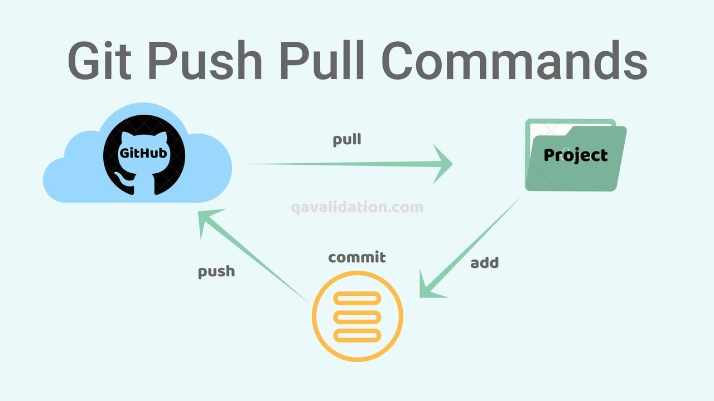

### ✏️ 백업

---

#### 💭 Git 무료 호스팅 추천

- Github
- Gitlab

#### 💭 지역저장소 <-> 원격저장소 연결



```
git remote add origin https://github.com/tubus1130/GIT_CLI.git
```

- 지역저장소는 기본적으로 여러개의 원격저장소와 연결될 수 있음
- origin은 별명(다른이름으로 해도되는데, 보통은 메인은 origin이라고 사용함)

#### 💭 연결되어있는 원격저장소 검색

```
git remote -v
```


#### 💭 push

```
# 어떤 원격저장소와 기본적으로 연결시킬지
git push --set-upstream origin master
```

- 지역저장소와 원격저장소를 연결한 후, 최초 1회 push에 한해서 이 명령어 실행
- origin이라는 원격저장소의 master브랜치를 기본으로 설정

---

#### 💭 clone

```
git clone https://github.com/tubus1130/GIT_CLI.git
```

- 원격저장소로부터 다른 지역저장소로 복제
- GIT_CLI라는 폴더가 만들어짐

#### 💭 pull

```
git pull
```

- 원격저장소의 최신상태를 지역저장소로 받아옴
- 작업 시작할때는 언제나 git pull 하고 작업이 끝낸뒤 git push 하는 습관을 들이는게 좋음