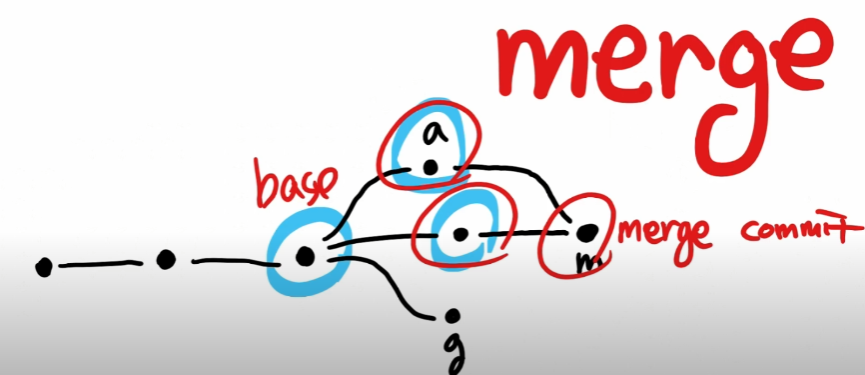
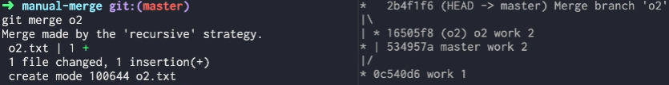
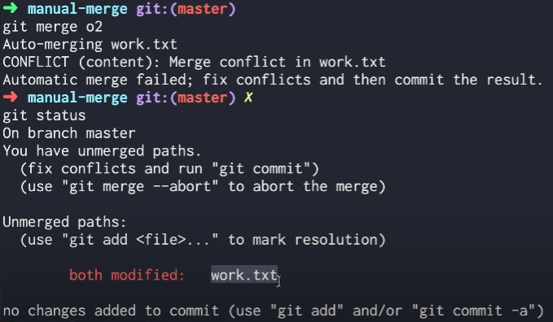
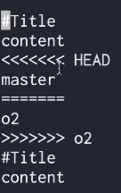
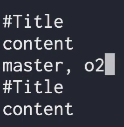
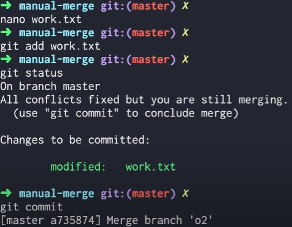
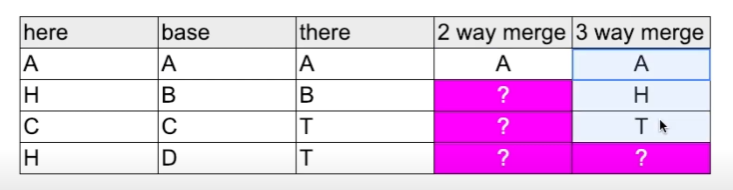
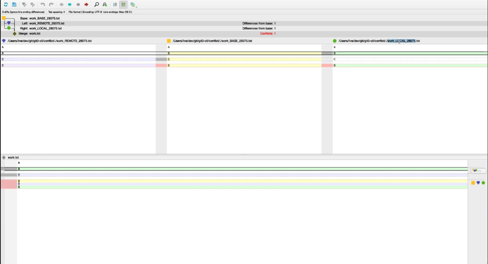
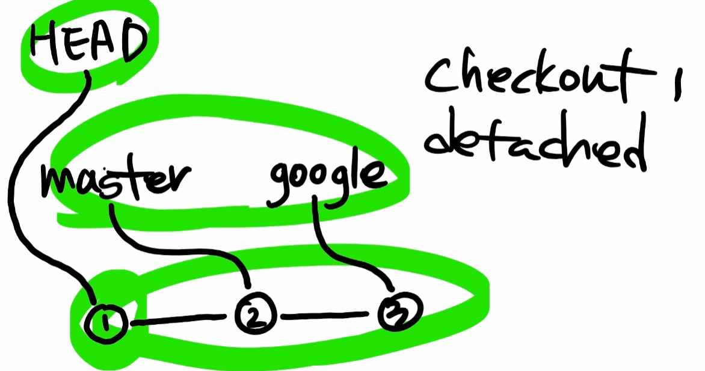
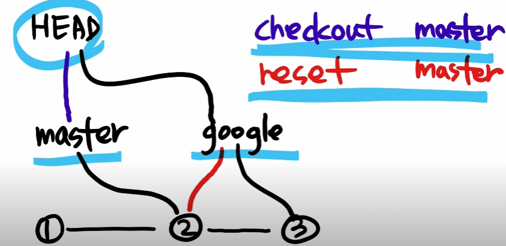

### ✏️ 브랜치

---

>`master 브랜치` : 저장소를 처음 만들면, Git은 master라는 브랜치를 자동생성함<br>
> 새로운 브랜치를 만들어 checkout하지 않는 한, 모든 작업은 master브랜치에서 일어남

#### 💭 브랜치 그래프로 보기

```
# 브랜치를 전체보여주고 시각적으로 한줄로 로그표시
git log --all --graph --oneline
```


---

#### 💭 브랜치 생성

```
# 브랜치 종류 모두 보여줌
git branch

# 브랜치 추가
git branch 브랜치명
```


---

#### 💭 브랜치 이동

```
# 해당 브랜치로 이동
git checkout 브랜치명
```


#### 💭 각 브랜치마다 커밋 만들고 로그확인


---

#### 💭 브랜치 병합



```
# 브랜치 병합(기준이 되는 브랜치로 이동해서 다음 명령어 실행)
git merge 병합하고 싶은 브랜치명
```

#### 💭 merge(충돌 x)



- 서로 다른 파일 병합할 경우
- 같은파일, 다른부분 병합할 경우

#### 💭 merge(충돌 났을 경우)



- 같은파일, 같은부분 병합할 경우



- <<<<<과 >>>>>사이가 충돌난 부분이다.
- 이 부분을 사용자가 따로 충돌을 해결하고 커밋해야된다.





#### 💭 3-way-merge



- here, there => 브랜치
- base => 브랜치들의 뿌리 커밋

#### 💭 merge 도구
- p4merge

```
# 설정
git config --global merge.tool p4merge
git config --global mergetool.p4merge.path 'C:\Program Files\Perforce\p4merge.exe'

# 실행
git mergetool
```



---

#### 💭 checkout 의미



- `checkout`은 HEAD가 가리키는 것을 변경하는 것(제어)
- HEAD는 기본적으로 브랜치를 가리키게 되지만, COMMIT 버전을 가리킬 수 도 있음. 이상태를 `detached`라고 부름

#### 💭 checkout, reset 비교



#### checkout
- checkout은 HEAD를 바꾸는 것
- `change`
- checkout master, checkout google 처럼 주로 브랜치를 가리킴

#### reset

- reset은 브랜치를 바꾸는 것
- google이 가리키는 버전이 3에서 2로 바뀌게 되어, 3의 연결이 끊기는 `delete`느낌
- reset 1, reset 2 처럼 주로 버전의 이름을 가리킴