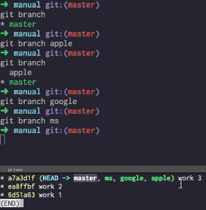
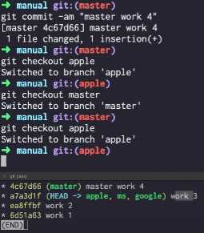
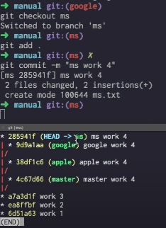

### ✏️ 브랜치

---

#### 💭 브랜치 그래프로 보기

```
# 브랜치를 전체보여주고 시각적으로 한줄로 로그표시
git log --all --graph --oneline
```


---

#### 💭 브랜치 생성

```
# 브랜치 종류 모두 보여줌
git branch

# 브랜치 추가
git branch 브랜치명
```



---

#### 💭 브랜치 이동

```
# 해당 브랜치로 이동
git checkout 브랜치명
```



#### 각 브랜치마다 커밋 만들고 로그확인

