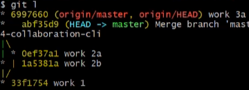
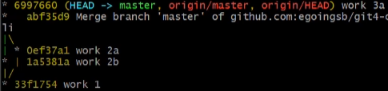

### ✏️ 협업

---

#### 💭 fetch


```
# 원격저장소의 커밋내용만 일단 가져옴, pull과 다르게 내용자체를 덮어씌우진 않음
git fetch
```



- 신중하게 데이터를 pull 하고 싶을 때 사용
- fetch의 결과 지역저장소의 커밋은 최신커밋보다 뒤쳐짐

```
# fetch한 버전과 내 현재버전을 합침
git merge origin/master

# FETCH_HEAD라고하면 직접 원격브랜치(origin/master)를 지정안해도됨
git merge FETCH_HEAD
```



- FETCH를 하면 git은 디렉토리에 FETCH_HEAD라는 파일을 만듬
- 이 FETCH_HEAD 파일에는 원격저장소에서 가져온 커밋버전이 적혀있음

> 즉, git pull의 과정은 `git fetch + git merge FETCH_HEAD` 와 같음