### ✏️ 버전관리

---

#### 💭 Initialize Repository

```
git init
```
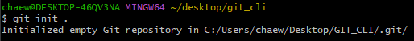

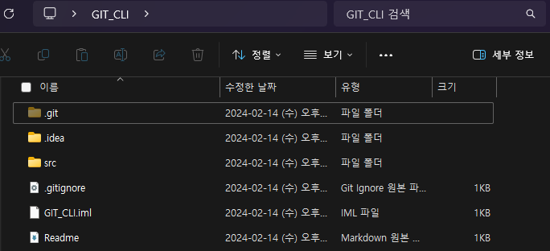

- `.git` 이라는 폴더가 버전관리를 해주는 폴더(`Repository`)이다. 이 폴더를 삭제하면 버전관리했던 모든게 날아간다.


- `Working Tree` : 버전으로 만들어지기 전 단계(수정, 작업중)
- `Staging Area` : 여기에 있는 파일들만 버전들로 만듬(버전으로 만들려는 파일들)
- `Repository` : 버전이 저장되있는 곳(만들어진 버전)

---

#### 💭 Working Tree Status
```
git status
```

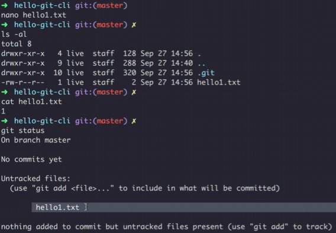

#### 💭 Add to Staging Area
```
# 특정파일
git add 파일명

# 변경사항 전체
git add .
```

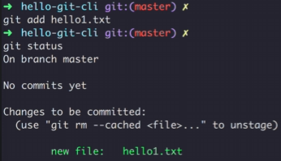

#### 💭 Create Version
```
git commit -m "메시지명"

# add + commit(추적중인 파일만 가능)
git commit -am "메시지명"
```


---

#### 💭 Show Version
```
git log
```

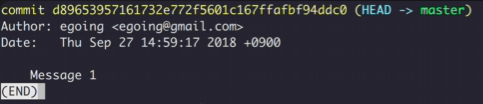

```
# 커밋된 파일보기
git log --stat
```


```
# 커밋된 파일 수정내용 보기
git log -p
```

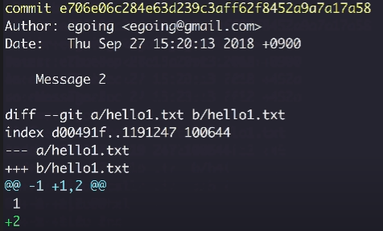

---

#### 💭 Show Changes

```
# 마지막 버전과 Working Tree와의 차이점
git diff
```

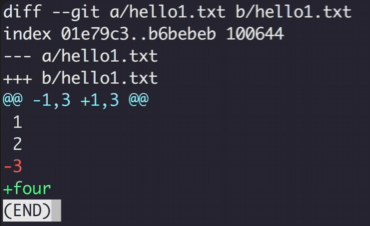

#### 💭 Checkout

```
# 원하는 커밋상태로 되돌아감
git checkout 커밋아이디
```

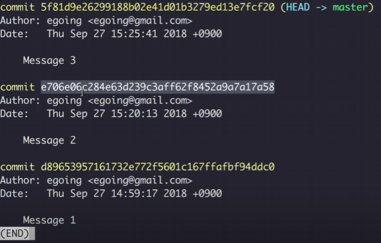

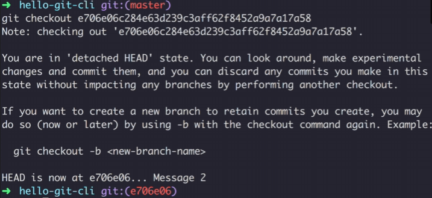

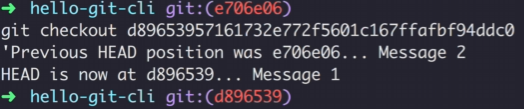

```
# 최신상태로 돌아감
git checkout master
```

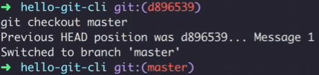

#### 💭 reset

```
# 커밋 내역들을 삭제하고, 특정 시점의 커밋으로 되돌아감
git reset --hard 커밋아이디
```

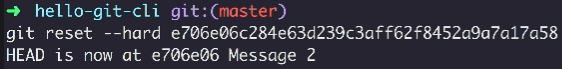

#### 💭 revert

```
# 이전 커밋 내역들은 그대로 두고, 되돌리고 싶은 커밋의 코드만 복원
git revert 커밋아이디
```

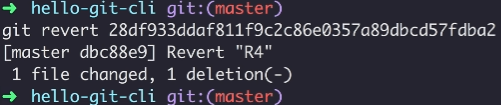

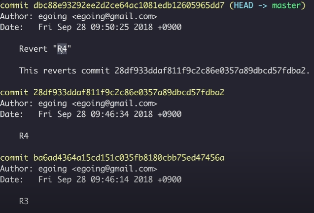

- 만일 되돌려야 할 버전이 2개 이상이라면 하나씩 역순으로 되돌려야함.(4 => 3 => 2)
- 한번에 revert 해버리면 충돌발생

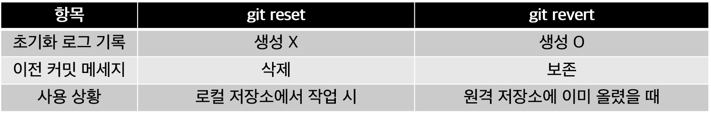