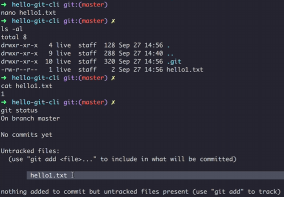
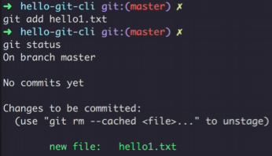
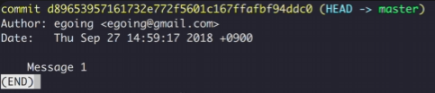
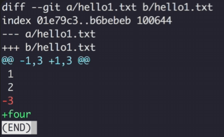

### ✏️ 버전관리

---

#### 💭 Initialize Repository

```
git init
```


- `.git` 이라는 폴더가 버전관리를 해주는 폴더(`Repository`)이다. 이 폴더를 삭제하면 버전관리했던 모든게 날아간다.


- `Working Tree` : 버전으로 만들어지기 전 단계(수정, 작업중)
- `Staging Area` : 여기에 있는 파일들만 버전들로 만듬(버전으로 만들려는 파일들)
- `Repository` : 버전이 저장되있는 곳(만들어진 버전)

---

#### 💭 Working Tree Status
```
git status
```



#### 💭 Add to Staging Area
```
git add 파일명
```



#### 💭 Create Version
```
git commit -m "메시지명"
```


---

#### 💭 Show Version
```
git log
```



```
# 커밋된 파일보기
git log --stat
```


```
# 커밋된 파일 수정내용 보기
git log -p
```


---

#### 💭 Show Changes

```
# 마지막 버전과 Working Tree와의 차이점
git diff
```



