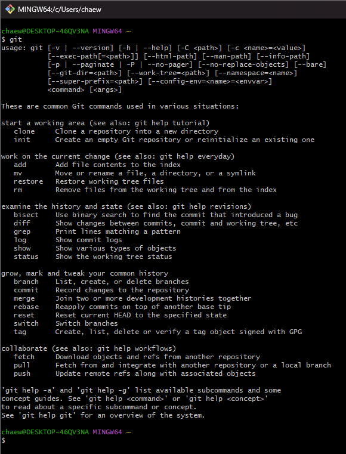

### ✏️ GIT 설치

---

GIT Bash 이용

[GIT Bash 설치 링크](https://git-scm.com/)

#### 💭 설치 후 확인
```bash
git
```


#### 💭 깃 기본 에디터 설정

```
# 깃 에디터 변경 -> vim
git config --global core.editor "vim"

# 깃 에디터 변경 -> nano
git config --global core.editor "nano"
```